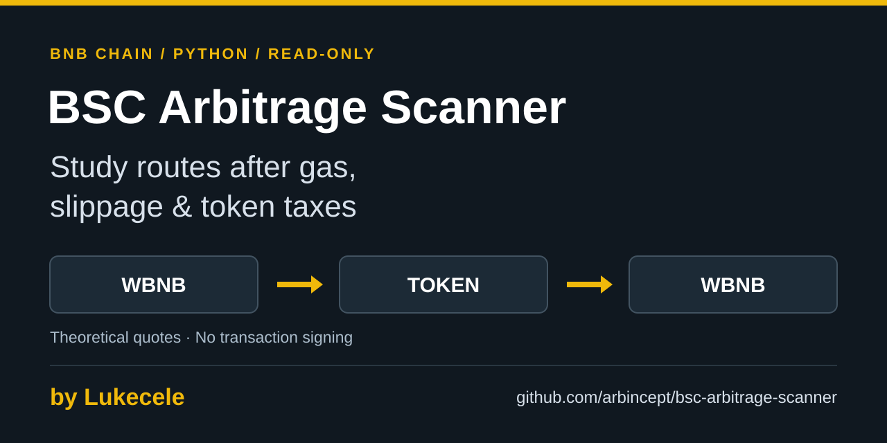

<div align="center">

# BSC Arbitrage Scanner



**Explore quoted arbitrage spreads after gas, slippage, and token taxes.**

Built and maintained by **[Luca Celebrano · @Lukecele](https://github.com/Lukecele)**, founder of [Arbitrage Inception](https://github.com/arbincept).

**[Quick start](#quick-start)** · **[Star this repository](https://github.com/arbincept/bsc-arbitrage-scanner)** · **[Follow Lukecele](https://github.com/Lukecele)**

[Quick start](#quick-start) · [Contribute](#contribute) · [MIT license](LICENSE)

</div>

## What it does

A compact Python research tool for a **WBNB → token → WBNB** quote cycle on BNB Smart Chain.

| Input | Purpose |
| :--- | :--- |
| **KyberSwap** | Buy/sell route quotes and a route-build check. |
| **GoPlus** | Reported buy/sell taxes and token security flags. |
| **DexScreener** | Reported liquidity across token pairs. |
| **Public token lists** | Tokens to scan, alongside the configured ARB INC token. |

The scanner adjusts quoted output for taxes, a slippage buffer, and estimated gas before comparing it with an alert threshold. It uses synchronous HTTP requests; it does not sign or broadcast transactions.

## Quick start

Use **Python 3.10+** with network access to the data providers.

```bash
git clone https://github.com/arbincept/bsc-arbitrage-scanner.git
cd bsc-arbitrage-scanner
python3 -m venv .venv
source .venv/bin/activate
python -m pip install -r requirements.txt
python scanner.py
```

On Windows, activate the environment with `.venv\Scripts\activate` instead.

The terminal shows scanning progress. When a quote cycle meets the configured threshold and route-build checks, it prints an alert with estimated taxes, gas, ROI, and route paths. Stop with **Ctrl+C**. No wallet or private key is required.

### Terminal example

**Illustrative layout, not captured output.** Labels below are simplified in English; brackets mark placeholders, not measured results. The scanner currently prints its alert labels in Italian.

```text
Scan: [time] [index/total] [symbol]
Input: 0.005 BNB (default)

When the alert conditions pass:
Liquidity: [reported USD]
Token taxes: buy [rate] / sell [rate]
Slippage buffer: 0.5% (default)
Estimated gas: [BNB]
Estimated net ROI: [percent] / [BNB]
Buy path: [DEX] -> [DEX]
Sell path: [DEX] -> [DEX]
```

Liquidity and taxes are provider-reported values. Gas combines estimates from both quote legs; net ROI compares the adjusted return with the input. Paths name exchanges returned by the aggregator. An alert also requires both route-build checks and a two-minute per-token cooldown. See [Read the estimates correctly](#read-the-estimates-correctly) before interpreting any output.

## Configure your research

Edit the constants near the top of [scanner.py](scanner.py):

| Setting | Default | Meaning |
| :--- | :--- | :--- |
| `BNB_INPUT_AMOUNT` | `0.005` | Simulated input size in BNB. |
| `MIN_PROFIT_PCT` | `1.0` | Minimum estimated net ROI percentage for an alert. |
| `SLIPPAGE_BUFFER_PCT` | `0.5` | Buffer deducted from quoted output. |
| `MIN_POOL_LIQUIDITY_USD` | `500` | Lower bound applied when reported liquidity is positive. |
| `MAX_ALLOWED_TAX_PCT` | `10.0` | Maximum reported buy or sell tax percentage. |
| `ARB_INC_TOKEN` | Defined in source | Token always included in the scan list. |

## Read the estimates correctly

The model applies buy tax before requesting the return quote, then deducts sell tax, slippage, and gas from the return amount. An alert describes a **theoretical quoted opportunity**, not realized profit.

- Quotes are fetched at different times and may change before execution.
- A successful route-build response does not prove a transaction would succeed or be profitable.
- Missing security data currently falls back to default values, and zero/unknown liquidity does not trigger the positive-liquidity filter. Missing data must not be read as a clean security result.
- Security results are cached for the process lifetime; liquidity is cached for 15 minutes.

These limits make the scanner useful for studying routing and cost assumptions, with further verification required before acting on an alert.

## Explore the code

The implementation lives in [scanner.py](scanner.py). Start with `evaluate_token` for the scan flow, `calculate_trade_metrics` for the pure cost model, `get_token_security` and `get_token_liquidity` for provider handling, and `verify_kyber_executable` for the route-build check.

Dependencies are declared in [requirements.txt](requirements.txt). The deterministic cost-model checks run with the Python standard library and do not call external providers:

```bash
python -m unittest discover -s tests -p 'test_*.py'
```

## Contribute

Reproducible bug reports, clearer documentation, and focused improvements are welcome. Start with an [issue](https://github.com/arbincept/bsc-arbitrage-scanner/issues) describing the behavior, environment, and expected result. Include the relevant checks with a pull request.

For sensitive reports, use the organization's [security policy](https://github.com/arbincept/.github/blob/main/SECURITY.md).

## More from Lukecele

This project is part of an independent ecosystem built by **[Luca Celebrano (@Lukecele)](https://github.com/Lukecele)**.

[Arb-Inc All-in-Dex](https://github.com/arbincept/Arb-Inc-All-in-Dex) · [Inception Flap Scanner](https://github.com/arbincept/inception-flap-scanner) · [Arbitrage Inc Earn](https://github.com/arbincept/arbitrage-inc-earn)

If this project helps you, **[give it a star](https://github.com/arbincept/bsc-arbitrage-scanner)** and **[follow Lukecele](https://github.com/Lukecele)** for future builds. [Sponsorship](https://github.com/sponsors/Lukecele) helps support ongoing work.

[Telegram](https://t.me/ArbitrageInception) · [Updates on X](https://x.com/Arbitrageincept) · [MIT license](LICENSE)
